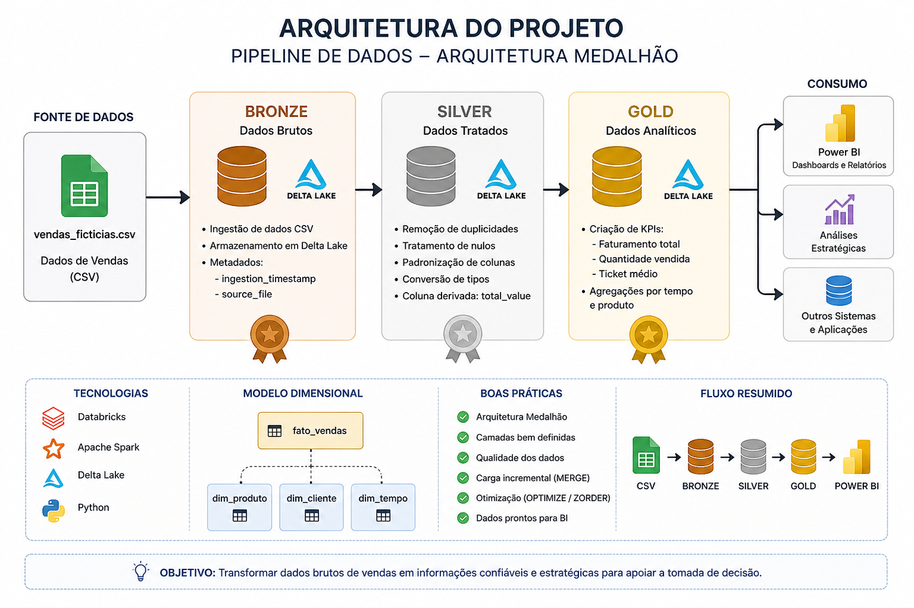
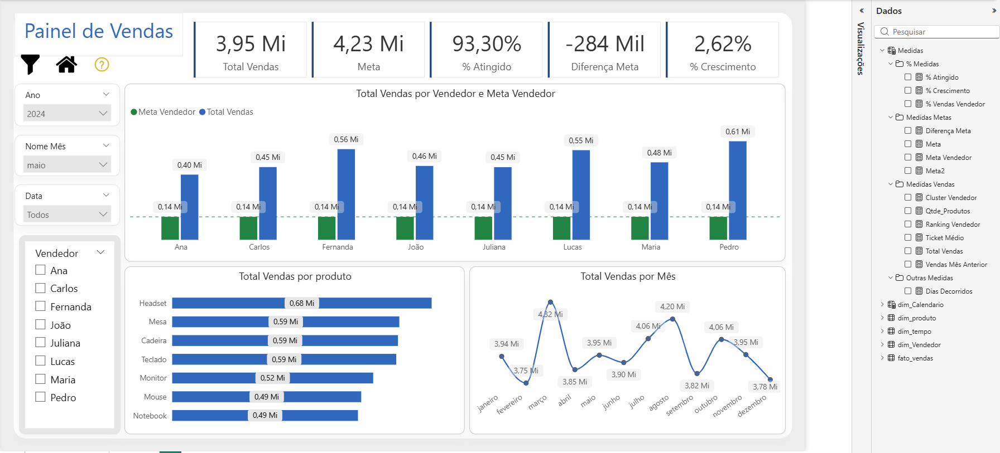
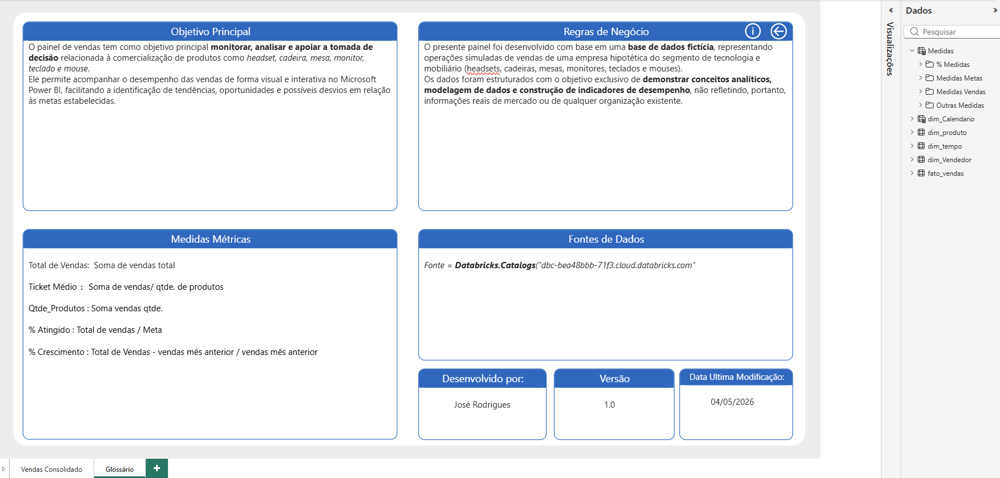
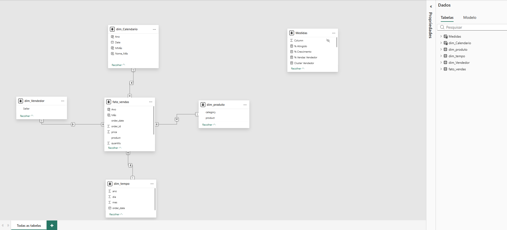

#  Pipeline de Engenharia de Dados com Databricks (Arquitetura Medalhão)

##  Visão Geral

Este projeto demonstra a construção de um pipeline completo de engenharia de dados utilizando a arquitetura medalhão (Bronze, Silver e Gold) no Databricks.

O objetivo é transformar dados brutos em informações analíticas prontas para consumo em ferramentas de BI, garantindo qualidade, organização e desempenho.

---

##  Arquitetura



Fluxo de dados:

CSV → Bronze → Silver → Gold → Power BI

---

##  Camada Bronze (Ingestão)

* Leitura de arquivo CSV
* Armazenamento em formato Delta Lake
* Inclusão de metadados:

  * ingestion_timestamp
  * source_file

---

##  Camada Silver (Tratamento)

* Remoção de duplicidades
* Tratamento de valores nulos
* Padronização de nomes de colunas
* Conversão de tipos de dados
* Criação da coluna `total_value`

---

##  Camada Gold (Consumo)

* Criação de métricas de negócio:

  * Faturamento total
  * Quantidade vendida
  * Ticket médio

* Agregações por:

  * Tempo
  * Produto

---

##  Modelagem Dimensional (Star Schema)

* **Fato:**

  * fato_vendas

* **Dimensões:**

  * dim_produto
  * dim_cliente
  * dim_tempo

---

##  Dashboard

O dashboard foi desenvolvido com o objetivo de analisar os dados de vendas de forma interativa, permitindo identificar tendências, desempenho por produto e indicadores estratégicos.

---

###  Visão Geral



---

###  Análise Detalhada



---

###  Modelo de Dados



---

###  Medidas DAX (Exemplo)

Principais medidas utilizadas:

```DAX
Faturamento Total = SUM(fato_vendas[total_value])

Quantidade Vendida = SUM(fato_vendas[quantity])

Ticket Médio = DIVIDE([Faturamento Total], [Quantidade Vendida])
```

---

##  Tecnologias Utilizadas

* Databricks
* Apache Spark (PySpark)
* Delta Lake
* Unity Catalog
* Power BI

---

##  Boas Práticas Aplicadas

* Arquitetura medalhão
* Separação por camadas
* Uso de Delta Lake
* Carga incremental com MERGE
* Otimização com OPTIMIZE e ZORDER

---

##  Possível Uso

Este pipeline pode ser utilizado como base para construção de dashboards analíticos no Power BI, apoiando a tomada de decisão com dados confiáveis e estruturados.

---

##  Autor

Jose Rodrigues
